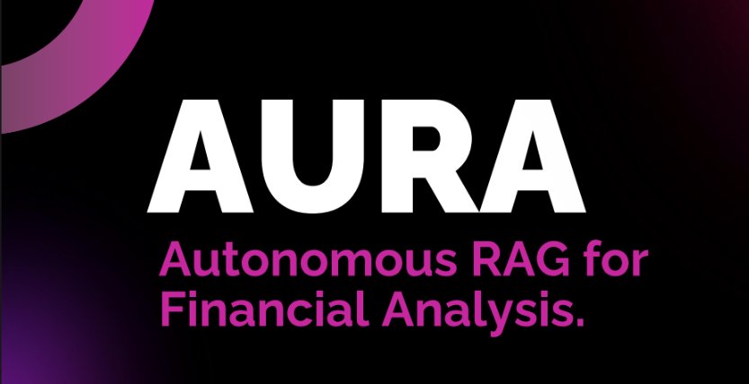
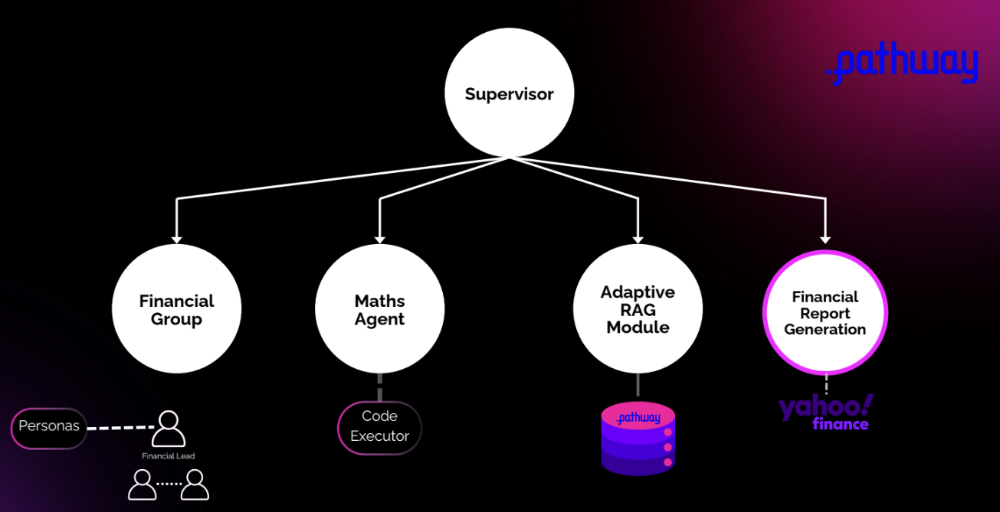

# AURA
Autonomous RAG for Financial Analysis


<br/>
Demo: <a href="https://drive.google.com/file/d/1_Ilm0nZYD4hxCD9GABZTRU8Zq6MU2KZ7/view?usp=sharing">Video</a>
<br/>
For code & detailed videos: <a href="https://drive.google.com/drive/folders/1zlk75DLOMGkvq8CcpdNrOKV-2dHPWoMm?usp=sharing">Click Here </a>
<br/>
*Note: drive link shared due to large file sizes.*

* To run the server we used for testing run main.py, this will initialize the PathwayVectorServer
* To run the backend, first create a python environment and install from requirements.txt. Replace the pathway library folder in the environment from the one provided in the zip.
* To run the backend, run the command python main.py in the server folder

---
# Architecture 



This architecture is centered around a **Supervisor agent** that orchestrates four specialized sub-agents:

* **Financial Group**, which interacts with domain-specific personas like the Financial Lead.
* **Maths Agent**, supported by a Code Executor for calculations and logic.
* **Adaptive RAG Module**, which leverages internal `.pathway` databases for dynamic retrieval.
* **Financial Report Generation**, which integrates with external sources like **Yahoo Finance** to produce final reports.

Together, they form a modular, extensible agentic system for financial analysis and reporting.

---


# For running frontend 

- navigate to client folder 
``` cd client ```
```  npm i ```

- create .env.local with reference to .env.example
- log into google cloud console
- Start a project and get your key as json
- place the key.json at the root of client
- Upadte the backend url to your local backend endpoint (search http and replace)

``` npm run dev ```

- frontend will start at localhost


# Website flow

## Navigation Table

| Endpoint    | Description           | Navigation Options         | Navigated To |
|-------------|-----------------------|----------------------------|--------------|
| `/`         | Landing page          | Try now button             | `/chat`      |
| `/chat`     | New Chat window       | Sidebar: replay history    | `/replay`    |
|             |                       | Sidebar: upload PDFs       | `/upload`    |
| `/replay`   | Replay history        | Sidebar: upload PDFs       | `/upload`    |
| `/upload`   | Upload PDFs           |                            |              |


### /chat 

- Chat with the model.
- press play button to see the decision tree simulation
- Press Save Chat to save all the chat history for future replays 

### /replay

- Press play to sun the simulation of the latest saved chat history with the side by side decision tree

### /upload 

- upload pdfs you want to provide as data source 

